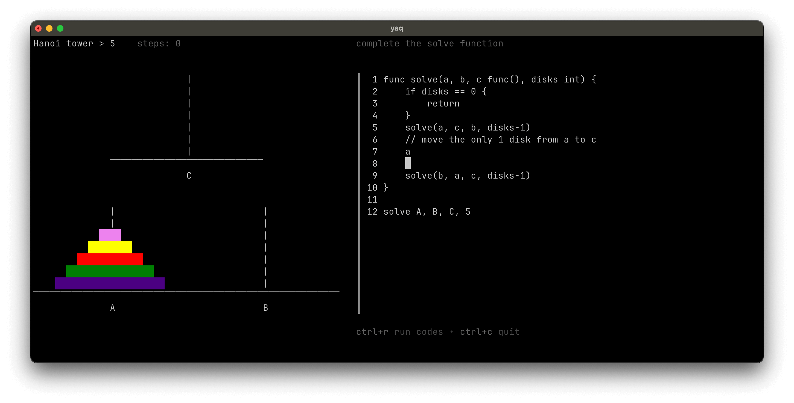
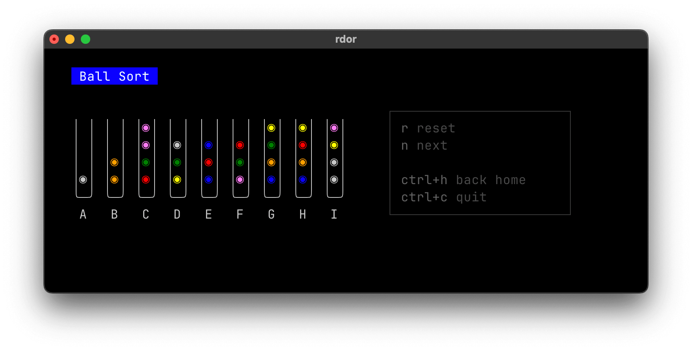

这里的前端或称客户端，指 terminal、手机、pc 桌面及浏览器 web 应用，凡有用户交互的地方皆可称也。

前端并非 Go 擅场， 这里仅分享个人相关经历体会。

## TUI

Terminal UI，终端上的 UI，也就是命令行客户端。

1. 命令行求一个简洁高效，如 kubectl、hugo 这样的工具：

```sh
kubectl get namespace
hugo serve
```

这类工具的编写，go 标准库有 flag 包，另有 spf13/cobra 和 urfave/cli 两个三方库，都很好用，cobra 的作者同时也是 hugo 工具的作者。

2. 带上色彩，较复杂的 TUI，经典的如 vim/neovim 编辑器， 实际 neovim 加上插件就可以组成一个不错的 IDE。

不得不提 go 现在有了 bubbletea 系列库，确实不错，个人也用其写过一些小游戏和应用,观感如下：

[yaq](https://github.com/zrcoder/yaqs)



[rdor](https://github.com/zrcoder/rdor)



[leetgo](https://github.com/zrcoder/leetgo)


## GUI

手机、平板、电脑等桌面 UI，基本一种操作系统就有一种编程语言和框架来做。如 iOS/MacOS 的 objective-c/swift 语言和 cocoas 框架，Android 的 Java/Kotlin 语言与 SDK，windows 我只知道古早的 mfc 框架，学生时代在图书馆的书上看到的（书籍并不太适合传承编程知识，效率太低，不过不影响当时的探究热情，当时都没有自己的电脑）。

也有一些框架试图统一，如 Flutter、Qt、React Native 等，实际上并不怎么成功，没普及起来，各种系统的差异给类似的框架带来巨大挑战。Go 语言方面有两个库值得一提：fyne 和 wails，fyne 可类比 Qt，wails 可类比 Electron，都不怎么成熟。比如 fyne 中并没有类似 monaco-editor （js 生态编辑器库，vscode 就用该组件）的组件，如果从头写一个，就太费劲了。wails 是把 js 和 go 合并了，是个小小创新，可以在其官网看看它的工作原理： https://wails.io/zh-Hans/docs/howdoesitwork 。但这样的意义可能并不大，首先不比前后分离的主流做法强多少，其次也不比 Electron 强多少。

## Web UI

狭义上的前端。之前看七牛许式伟的一些文章，认为一统前端的重任可能比较适合落在 web 这里，原因是浏览器已经帮我们抹平了各种 os 的差异，在浏览器之上做应用要方便得多——这个观点让我深受启发。老许还提到更好的方向是 pwa（渐进式 web 应用，可以从浏览器“下载”到本地用）和小程序。pwa 接触过，后边推荐的 go-app 库就是生成的 pwa；小程序还没有尝试，但总觉小程序有大厂的小气在，腾讯、阿里、华为各有一套框架和工具。

Web UI 基本是 js 的天下。Go 在这方面有几个独辟蹊径的尝试。

### Go 模板

在 html 里写一些特殊标志(用 “{{”和“}}” 包裹的内容），用数据填充模板形成最终的 html。比如：

```go
const htmlTemplate =`
<!DOCTYPE html>
<html lang="en">
<head>
    ...
</head>
<body>
    <p>Hello {{.}}</p>
</body>
</html>
`

tmpl := template.Must(template.New("").Parse(htmlTemplate))

data := "world"

err := tmpl.Execute(someWriter, data)

...
```

另外支持条件判断、预定义函数等功能。

使用 go 模板的应用，可以参考 Go 官方的 [present 工具](https://github.com/golang/tools/tree/master/cmd/present)， 另外较著名的有 [hugo](https://github.com/gohugoio/hugo) 及国人的 [asouldocs](https://github.com/asoul-sig/asouldocs) 项目。

### Gopherjs

这是一个编译器，能把 Go 代码编译成 js 代码。没有深入使用，实际上该库团队也转战下边要说的对 WebAssembly 的支持了。

### Go + WebAssembly

Go 从 1.11 版本加入了对 WebAssymbly 的支持， 见 https://go.dev/wiki/WebAssembly 。这使得 Go 和 js 交互成为可能。之后涌现了不少框架和库，不过现在还活跃的很少了。

基于 WebAssymbly 的应用，比较深入和有意思的是 https://goplay.space/#draw ，首先，从头手撸了一个代码编辑器，虽然没有像 monaco-editor 那么强大，但是对该项目而言已经足够，也给大家一个从头手撸的参考；其次利用 cavas 实现了简单的海龟作图模块 —— 可惜这个项目现在也沉寂了。

虽然基于 Go + WebAssymbly 的大部分库和应用都沉寂了，但坚挺的还是有，最推荐的一个是 https://github.com/maxence-charriere/go-app ，类似 js 生态的 react， 用声明式语法写前端。个人基于该库维护有一个简单应用 [ndor](https://ndor.netlify.app)。

> 另一个有趣的库是[vugu](https://github.com/vugu/vugu)，类似 js 生态的 vue。和 go-app 不同的是，这个库又定义了一套方言（DSL），虽然语法并不复杂，但还是懒得去学了；go-app 那样用通用语言（Go）写就不错。

Go 的 WebAssymbly 有个问题是编译出来的 wasm 文件体积比较大，因为带了 go 的运行时。目前还没有一个较好的解决办法。

### amisgo

就是当前这个项目。基于百度的 amis 库，组件丰富、响应式布局，同时也简化了 amis 本身的数据获取及组件交互代码。

## 体会

用 Go 写前端，不怎么成熟，最大的问题是生态贫乏， 就比如上边推荐的 go-app， 框架不错，但是没有多少现成组件库可用。可以先做和 js 生态兼容的框架。

用 Go 比用 js 好在哪里？仁者见仁智者见智，我认为有强类型、工程管理方面的优势，当然，要先解决那些劣势再来提优势。所幸要解决那些劣势，并不是非常困难。
